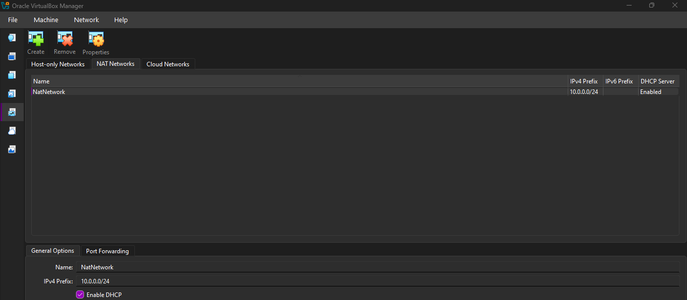
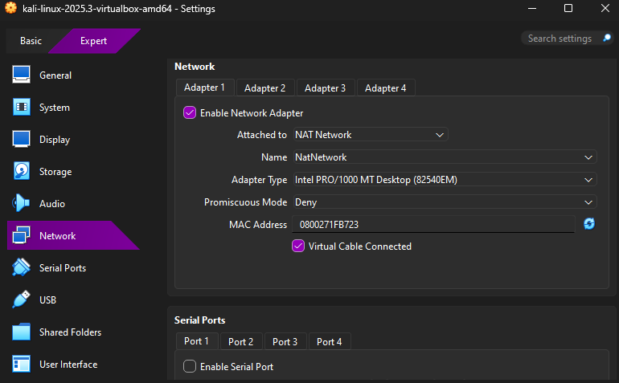
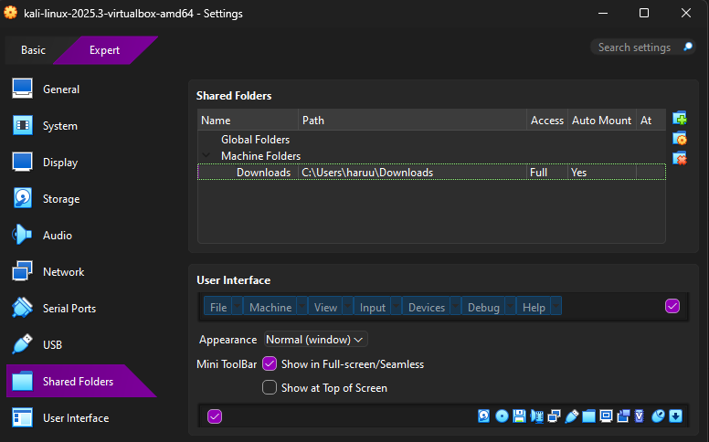
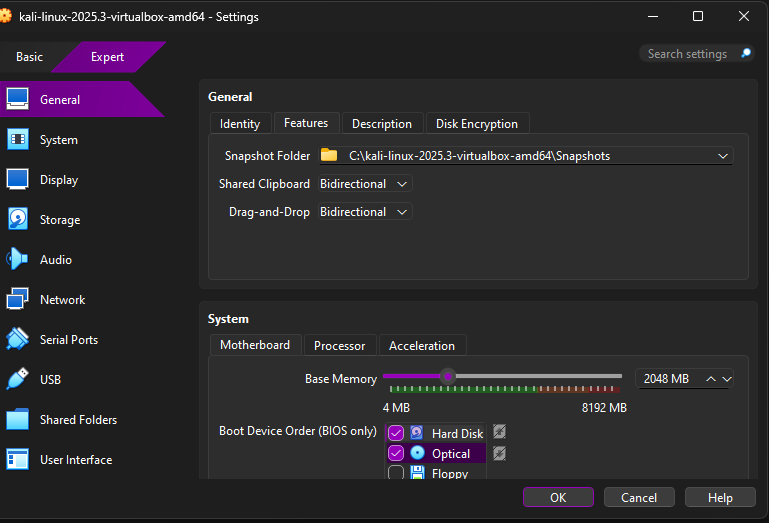
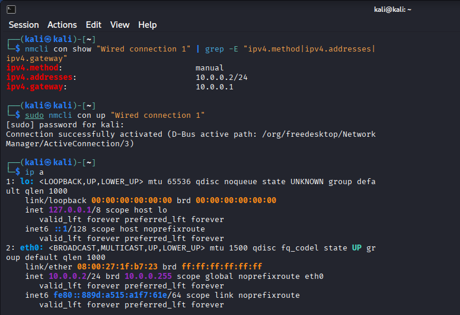
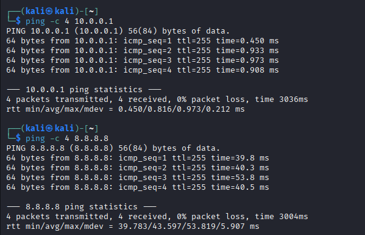
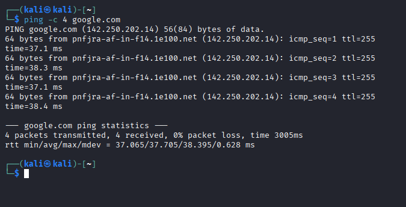
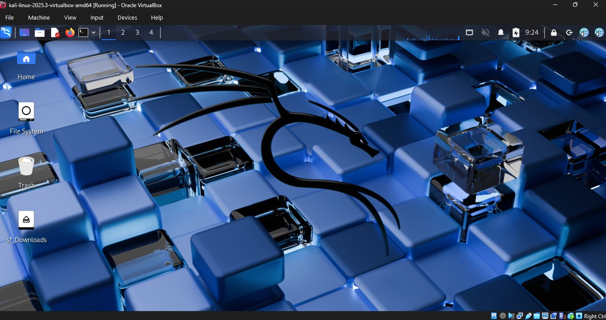

# 🛡️ Cybersecurity Testing Lab Environment Setup


## 📌 Project Overview

Welcome to my Week 1 project for the **NetworkWalks Internship**. The objective of this project was to design, configure, and deploy a foundational Cybersecurity Testing Lab using Oracle VirtualBox. This lab provides a safe, isolated environment for future penetration testing and network analysis, with Kali Linux acting as the primary testing machine.

## 🎯 Lab Requirements & Specifications

The following specifications were successfully implemented and verified:

* **Hypervisor:** Oracle VirtualBox (Latest Version)
* **Attacker Machine:** Kali Linux (2025.3)
* **Network Type:** NAT Network
* **Target Subnet:** `10.0.0.0/24`
* **Kali Linux IP Address:** `10.0.0.2/24` (Static)
* **Gateway IP:** `10.0.0.1`
* **Internet Access:** Full access verified
* **Integration:** Bidirectional Clipboard & Drag-and-Drop enabled
* **Shared Folders:** Host machine `/Downloads` folder mapped to the Kali VM

---

## ⚙️ Configuration Walkthrough

### 1. VirtualBox Network Configuration

A NAT Network was created to allow the VM to communicate with the host and external networks while remaining isolated.

* **Network Name:** `NatNetwork`
* **IPv4 Prefix:** `10.0.0.0/24`
* **DHCP:** Enabled (Note: Kali is configured with a static IP).

### 2. Virtual Machine Settings

* **Network Adapter:** Attached to `NAT Network` (`NatNetwork`).
* **General Settings:** Shared Clipboard and Drag-and-Drop were both set to **Bidirectional**.
* **Shared Folders:** The host machine's `Downloads` folder was mapped to the VM with **Auto-mount** enabled.

### 3. Kali Linux Network Configuration

Instead of relying on DHCP, the Kali Linux network interface was manually configured via the CLI using `nmcli` to ensure a static IP address for consistent testing.

```bash
# Command used to set static IP
sudo nmcli con mod "Wired connection 1" ipv4.addresses 10.0.0.2/24 ipv4.gateway 10.0.0.1 ipv4.method manual
sudo nmcli con up "Wired connection 1"
```

---

## 📸 Lab Screenshots

### 1. NAT Network Configuration



### 2. Network Adapter Settings



### 3. Shared Folders Configuration



### 4. Clipboard & Drag-and-Drop Settings



### 5. Kali Linux IP Configuration



### 6. Gateway Connectivity Test



### 7. Internet Connectivity Test



### 8. Kali Linux Desktop



---

## ✅ Lab Verification

The cybersecurity testing lab environment was successfully configured and tested.

* ✅ NAT Network configured
* ✅ Static IP assigned to Kali Linux
* ✅ Gateway connectivity verified
* ✅ Internet connectivity verified
* ✅ Shared folders configured
* ✅ Clipboard and Drag-and-Drop enabled
* ✅ Kali Linux testing environment successfully deployed
* ✅ Environment ready for future cybersecurity testing activities

---

## 🧰 Technologies & Tools

* **Oracle VirtualBox**
* **Kali Linux 2025.3**
* **NetworkManager / nmcli**
* **NAT Networking**
* **Linux CLI**

---

## 👩‍💻 Internship

**NetworkWalks Cybersecurity Internship**

**Project:** Week 1 – Cybersecurity Testing Lab Environment Setup

This project demonstrates the initial setup and configuration of a controlled cybersecurity lab environment for hands-on security testing and learning.
